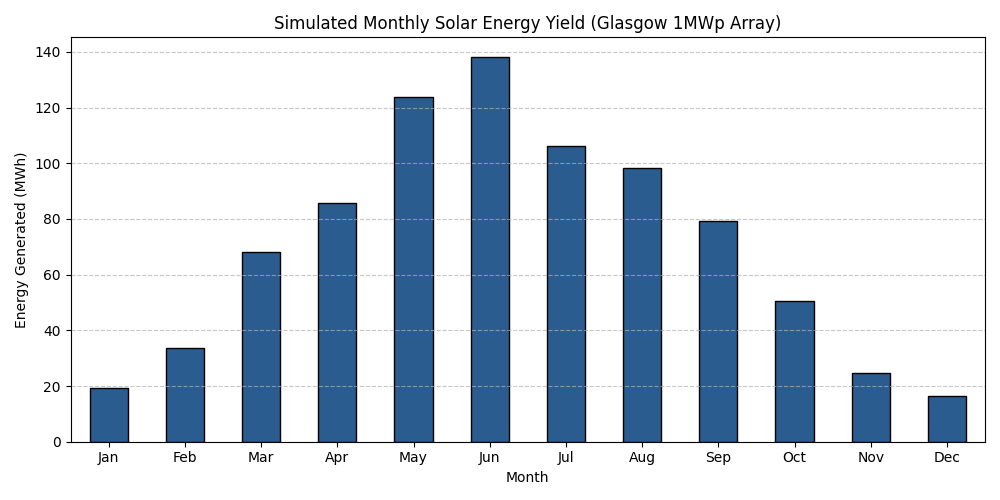
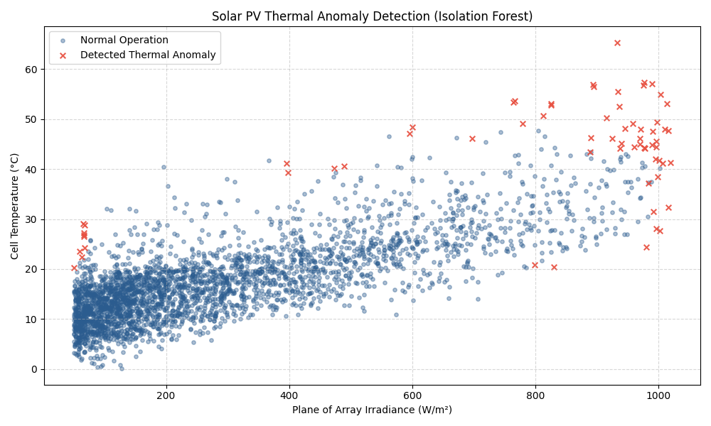
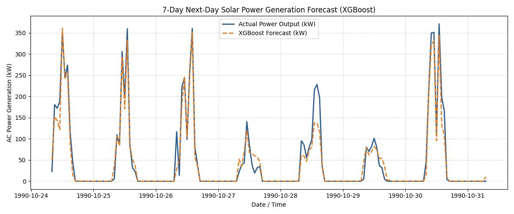
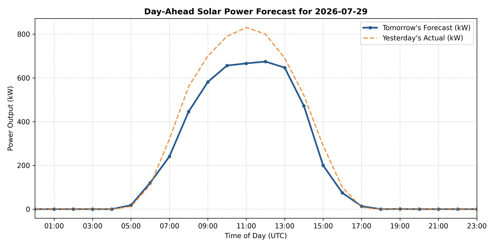

# ☀️ Solar PV Digital Twin: Physics Modeling, Thermal Anomaly Detection & Day-Ahead Forecasting

[](https://colab.research.google.com/drive/19FNtiTuhoA5KklFs8V2caBgFxKyDwvNK?usp=sharing)
[](https://www.python.org/)
[](https://pvlib-python.readthedocs.io/)
[](https://scikit-learn.org/)
[](https://xgboost.readthedocs.io/)
[](LICENSE)

An end-to-end Python pipeline for commercial solar asset management. This project combines physics-based performance modeling (**pvlib**), unsupervised operational fault detection (**Isolation Forest**), and machine learning power generation forecasting (**XGBoost**) for a 1 MWp grid-tied solar facility in Glasgow, UK.

---

## 📌 Executive Summary

Modern solar asset management requires moving from reactive maintenance to automated predictive analytics. This repository provides a complete digital twin pipeline designed to:
1. **Simulate Realistic Energy Yield:** Physics-driven modeling accounting for Plane of Array (POA) irradiance, cell temperature derating, and Balance of System (BOS) electrical losses.
2. **Automate Quality & Fault Detection:** Unsupervised identification of thermal over-temperature conditions and array degradation without reliance on historical labels.
3. **Enable Grid Integration:** 24-hour-ahead generation forecasting using lag-engineered GBDTs to support energy trading, battery dispatch, and grid balancing.

---

## ⚙️ System Architecture
```text
                      [ PVGIS TMY Weather Data ]
                                   │
                                   ▼
          ┌─────────────────────────────────────────────────┐
          │     Stage 1: Physics-Based Simulation           │
          │     - Solpos & POA Irradiance (pvlib)           │
          │     - Faiman Thermal Model                      │
          │     - Inverter & BOS AC Loss Derate (14%)       │
          └────────────────────────┬────────────────────────┘
                                   │
         ┌─────────────────────────┴─────────────────────────┐
         ▼                                                   ▼
┌─────────────────────────────────────────┐ ┌─────────────────────────────────────────┐
│ Stage 2: Unsupervised Anomaly Detection │ │ Stage 3: Supervised Day-Ahead Forecast  │
│ - StandardScaler Feature Normalization  │ │ - Chronological 80/20 Time-Series Split │
│ - Isolation Forest (O(n) complexity)    │ │ - 24-Hour Persistence Lags              │
│ - Automated Thermal Fault Profiling     │ │ - XGBoost Regressor (JSON Deployment)   │
└─────────────────────────────────────────┘ └─────────────────────────────────────────┘
```
---

## 🔑 Key Features & Technical Highlights

### 1. Physics Engine (`pvlib`)
* **Location & Asset Profile:** 1 MWp array located in Glasgow, UK (55.86°N, -4.25°W), optimized at 35° tilt and 180° South azimuth.
* **Temperature Derating:** Implements the Faiman thermal model with a temperature coefficient ($\gamma_{Pdc} = -0.35\%/^\circ\text{C}$).
* **Commercial AC Loss Calibration:** Incorporates a 97% inverter efficiency and an 88% Balance of System (BOS) derate factor (wiring, soiling, reflection), delivering a commercially realistic AC Performance Ratio (**~83% PR**).

### 2. Operational Anomaly Detection (`scikit-learn`)
* **Model:** Isolation Forest fitted on active daylight operating hours ($G_{\text{poa}} > 50 \text{ W/m}^2$).
* **Feature Engineering:** Evaluates non-linear cell-temperature-to-irradiance ratios ($T_{\text{cell}} / G_{\text{poa}}$).
* **Robustness:** Isolates anomalous overheating and localized electrical underperformance without assuming Gaussian feature distributions.

### 3. Day-Ahead Generation Forecasting (`XGBoost`)
* **Data Leakage Prevention:** Eliminates real-time irradiance dependency from prediction features; utilizes strictly historical 24-hour persistence lags (`power_lag_24h`, `poa_lag_24h`), temporal attributes, and weather metrics.
* **Strict Chronological Splitting:** Avoids target leakage by maintaining temporal sequence integrity (no random shuffling).
* **Physical Bound Enforcements:** Enforces non-negative output constraints via numerical clipping and explicit nighttime zeroing.

---

## 📊 Results & Visualizations

### 1. Simulated Monthly AC Energy Yield

*Annual AC energy generation profile for the 1 MWp array in Glasgow, demonstrating seasonal yield variations and applying realistic inverter & Balance of System (BOS) electrical losses.*

---

### 2. Operational Thermal Anomaly Detection

Unsupervised Isolation Forest isolating thermal overheating anomalies ( $T_{\text{cell}}$ vs. POA Irradiance) during active daylight operating hours ($>50 \text{ W/m}^2$).

---

### 3. 7-Day Out-of-Sample Power Generation Forecast

*XGBoost model performance over a 7-day test horizon, demonstrating robust prediction tracking across both clear-sky peaks and cloud-attenuated days without data leakage.*

---

### 4. Day-Ahead Operational Schedule vs. Historical Baseline

*Automated 24-hour day-ahead forecast generated for grid scheduling and battery dispatch, overlaying predicted generation against yesterday's actual yield.*

---

## 🚀 Quick Start

### Google Colab
Launch the pipeline instantly in your browser with zero setup:

[](https://colab.research.google.com/drive/19FNtiTuhoA5KklFs8V2caBgFxKyDwvNK?usp=sharing)

---

## 📁 Repository Structure

```
├── solar_pv_digital_twin.ipynb  # Interactive Google Colab Notebook
├── main.py (tbc)               # Master execution Python script
├── solar_xgboost_model.json    # Serialized production XGBoost model
├── requirements.txt (tbc)      # Dependencies list
├── README.md                   # Documentation
└── assets/                     # Output visualizations
    ├── monthly_yield.png
    ├── thermal_anomalies.png
    ├── power_forecast.png
    └── forecast_2026-07-29.png
```
---
## 💼 Business Impact & Commercial Applications

* Asset Management & O&M: Automates fault detection in SCADA feeds, enabling early identification of string failures or panel soiling before major yield losses occur.
* Energy Trading & Dispatch: Provides 24-hour-ahead production predictions needed for day-ahead market bidding, minimizing imbalance penalties.
* Storage Integration: Delivers localized generation curves required to optimize behind-the-meter Battery Energy Storage System (BESS) charge/discharge schedules.

---
## 🛠️ Tech Stack

* Language: Python 3.10+
* Domain Physics: pvlib-python
* Machine Learning: xgboost, scikit-learn
* Data Manipulation: pandas, numpy
* Visualization: matplotlib

---
## 📝 License
Distributed under the MIT License. See `LICENSE` for details.


   
